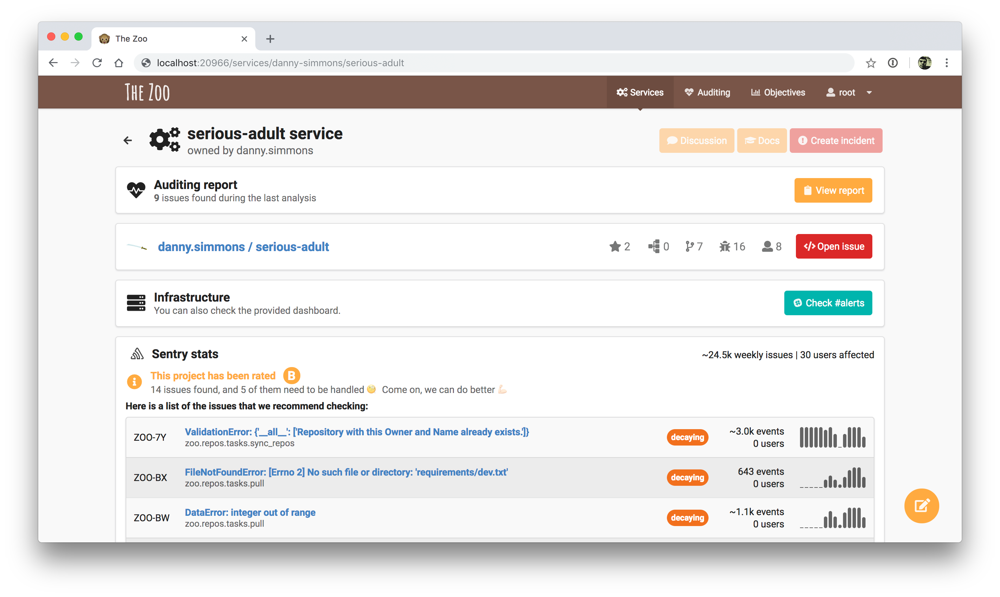

# zoo

A smart service catalogue providing an overview of your services' development and
operations.

[](https://python.org)
[](https://github.com/ambv/black)
[](https://discord.gg/Tx9FkEz)
[](https://gitlab.com/kiwicom/the-zoo/pipelines)



| What       | Where                                             |
| ---------- | ------------------------------------------------- |
| Discussion | [#the-zoo on Discord](https://discord.gg/Tx9FkEz) |
| Maintainer | [Alex Viscreanu](https://github.com/aexvir/)      |

## What is The Zoo

A microservice catalogue that allows performing static code checks and integrates with
third party services like Sentry, Datadog or Pingdom.

On top of that we have built a configurable static code analysis module that allows writing
your own code checks and The Zoo will keep track of the evolution of those issues. The checks
can also be integrated in CI so it can show how the Pull Request affects the status of the
issues.

The Zoo also provides analytics about how dependency usage and its versions evolve.

## Development

### Initial setup

- Create a database: `$ make migrate`
- Create a superuser: `$ make superuser`
- Create `.env` file as documented below

### How to run

- Run in debug mode: `$ make run`
- Stop: `$ make stop`
- Stop and/or delete data: `$ make destroy`
- Django shell: `$ make shell`
- Containers logs: `$ docker-compose logs`

Access web locally:

- Web is running on port `20966`
- Login at <http://localhost:20966/admin> with your superuser account
- Access zoo at <http://localhost:20966/>

### Database changes

- Generate database migrations: `$ make makemigrations`
- Update the database when needed: `$ make migrate`

### Notes

Check `Makefile` for shell commands if you want to run them with modified
parameters.

### Local .env file

Creating a local `.env` file (see [Docker docs](https://docs.docker.com/compose/env-file/)
on `.env` files) is necessary for some components in the app to work correctly,
a basic example of such file contains the following:

```
ZOO_DEBUG=1
ZOO_GITHUB_TOKEN=...
ZOO_GITLAB_TOKEN=...
ZOO_GITLAB_URL=https://gitlab.com
```

Version control tokens only need read access to repositories.

## Testing

Run all tests: `$ make test`

Tests are run by `tox`. In order to run only unit tests or a specific test file
you need to use the `pytest` binary from the `.tox/tests/bin/` folder. This
folder will be created after running tests for the first time.

### Testing requirements

PostgreSQL is needed for running the integration tests, you can install it by
running `brew install postgres`

Note that this includes running `dockerfile_lint` and `remark`, which you can
get with `npm install -g dockerfile_lint remark-cli`.

Also note that tox doesn't know when you change the `requirements.txt`
and won't automatically install new dependencies for test runs.
Run `pip install tox-battery` to install a plugin which fixes this silliness.

If you want to pass some env vars to environment, you can list them in env var
`TOX_TESTENV_PASSENV`. For example if you want to use custom database for tests,
you can run: `TEST_DATABASE_URL=postgres://... TOX_TESTENV_PASSENV=TEST_DATABASE_URL tox`

## Configuration for repositories

Repositories scanned by the Zoo may contain the `.zoo.yml` file. This file contains additional
information about the scanned repository and how and where it's used in production. If the Zoo
finds this file in the root of the project, it will read it and create a Service or a Library within
the Zoo with the provided information based on the collected data automatically.
Otherwise the data have to be added to the Zoo manually.

Here is an example of this file:

```yaml
type: service
name: hello-world-service
owner: booking
impact: profit
status: beta
docs_url: 'https://example.com/hello-world-service'
slack_channel: 'http://example.com/slack/channel'
sentry_project: 'http://example.com/sentry/hello-world-service'
sonarqube_project: hello-world-service
pagerduty_url: 'https://example.com/pager/hello-world-service'
tags:
    - tag1
    - tag2
    - tag3
environments:
    -
        name: staging
        dashboard_url: 'https://staging.example.com/dashboard'
        service_urls:
            - 'https://staging.example.com/service'
        health_check_url: 'https://staging.example.com/health_check'
    -
        name: production
        dashboard_url: 'https://production.example.com/dashboard'
        service_urls:
            - 'https://production.example.com/service'
        health_check_url: 'https://production.example.com/health_check'
```

Full schema for this file can be found in [zoo_yml.py](zoo/repos/zoo_yml.py)

## Documentation

### Architecture Decision Records

We document architecture decisions like it's described in
[this article](http://thinkrelevance.com/blog/2011/11/15/documenting-architecture-decisions).

Records are in dir `adr`. We are using [ADR Tools](https://github.com/npryce/adr-tools)
for working with them.

### Documentation for users

We use [Sphinx](http://www.sphinx-doc.org/) for generating documentation. Docs
are in dir `docs`.

Setup virtual enviroment and install there `docs-requirements.txt`. Then you can
use shortcuts:

- Build docs: `$ make build-docs`
- Open docs: `$ make open-docs`
